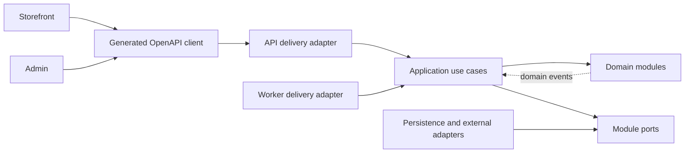
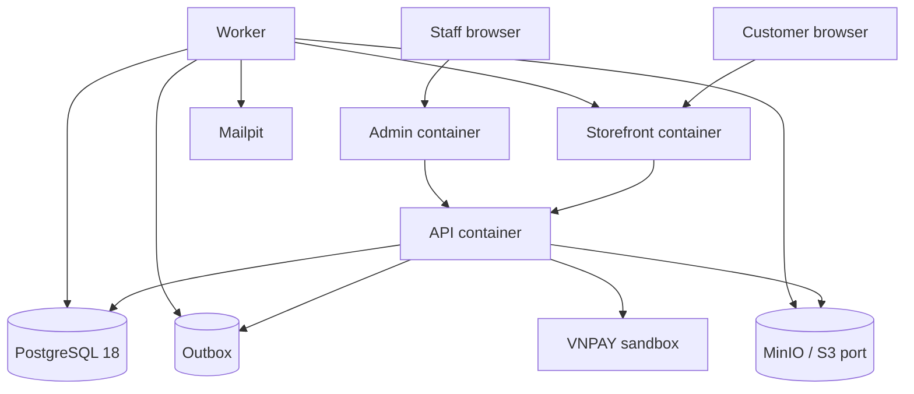
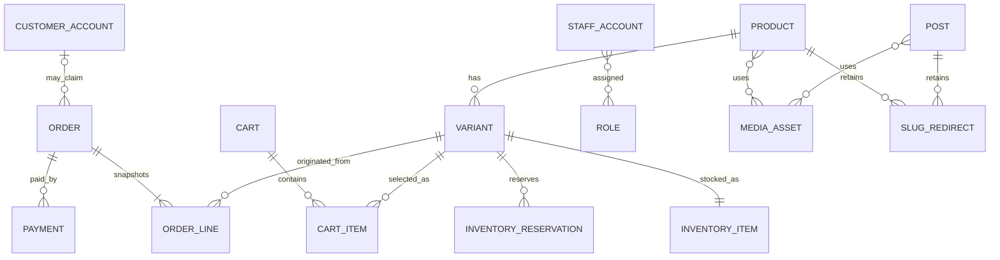

# Architecture Spine — Clothing Commerce Platform

## Design Paradigm

The system is a **modular monolith organized as vertical business slices with ports and adapters**. Business rules point inward; HTTP, persistence, payment, media, email, and scheduling are replaceable adapters.

| Layer | Namespace / location | Responsibility |
| --- | --- | --- |
| Delivery | `apps/api/src/http`, `apps/*/app` | HTTP/OpenAPI and UI composition |
| Application | `apps/api/src/modules/*/application` | Use cases, authorization, transaction boundaries |
| Domain | `apps/api/src/modules/*/domain` | Aggregates, policies, state transitions, domain events |
| Ports | `apps/api/src/modules/*/ports` | Required persistence and external capabilities |
| Adapters | `apps/api/src/adapters` | Prisma, VNPAY, object storage, email, clock and IDs |



## Invariants & Rules

### AD-1 — Monorepo application boundaries [ADOPTED]

- **Binds:** all
- **Prevents:** agents coupling public shopping, staff operations, and server runtime into one deployable or duplicating shared contracts.
- **Rule:** The pnpm/Turborepo monorepo contains separate `storefront`, `admin`, `api`, and `worker` apps. Apps may depend on versioned shared packages; they may not import another app's source. `storefront` and `admin` have independent build boundaries and share no page or business state.

### AD-2 — Business-module ownership [ADOPTED]

- **Binds:** api, worker, database
- **Prevents:** modules reading another module's repositories or tables and creating competing mutation paths.
- **Rule:** `Identity`, `CatalogInventory`, `CartCheckout`, `OrdersPayments`, and `ContentMedia` each own their application use cases, domain rules, and persistence port. Cross-module changes call an exported application capability or consume a domain event; direct cross-module repository/table access is forbidden.

### AD-3 — OpenAPI is the HTTP contract authority [ADOPTED]

- **Binds:** storefront, admin, api, contracts
- **Prevents:** handwritten DTO, error, enum, and mock drift between concurrent frontend and backend work.
- **Rule:** `contracts/openapi.yaml` is the sole public/admin HTTP source of truth. CI validates it and generates the TypeScript client/types/mocks consumed by both web apps. The API validates requests and responses against the contract. Contract changes land before implementations and require contract-owner review.

### AD-4 — Product, variant, and stock granularity [ADOPTED]

- **Binds:** storefront, admin, CatalogInventory, CartCheckout, OrdersPayments, database
- **Prevents:** one layer pricing or stocking a Product while another prices or stocks a size/color SKU.
- **Rule:** `Product` owns merchandising content; each purchasable size × color combination is a `Variant/SKU`. Price and available stock belong to the SKU. Cart items and immutable order lines reference/snapshot the SKU, never Product alone.

### AD-5 — Transactional history and state machines

- **Binds:** CartCheckout, OrdersPayments, database, contracts
- **Prevents:** historical orders changing with catalog/customer edits or payment and fulfillment states contradicting one another.
- **Rule:** Order lines snapshot SKU name/options/unit price; orders snapshot recipient/contact/address and quote components at placement. `domain-model.md` owns guarded Order, PaymentAttempt, Reservation, and Fulfillment transition tables with actor, stock/payment effect, audit event, and idempotent retry result. Order permits `pending_payment→confirmed|cancelled`, `confirmed→processing|cancelled`, `processing→shipped|cancelled`, `shipped→delivered|delivery_failed`, `delivery_failed→processing|cancelled`; online PaymentAttempt permits `pending→paid|failed|refund_required`, `paid→refund_required|refunded`, `refund_required→refunded`; COD PaymentAttempt permits `cod_due→cod_collected|cod_cancelled`; Reservation permits `active→consumed|released|expired`. Terminal states cannot transition. COD placement atomically consumes stock, creates `confirmed` Order and `cod_due` attempt; pre-shipment cancellation restocks once and sets `cod_cancelled`; failed delivery does not restock until an audited `return_received` command, after which cancellation/restock is idempotent. Delivery atomically sets `cod_due→cod_collected`. `cancelled + active reservation`, `cancelled + captured funds` without `refund_required|refunded`, and `shipped|delivered` without `paid|cod_due|cod_collected` are invalid.

### AD-6 — Inventory reservation and checkout authority [ADOPTED]

- **Binds:** CatalogInventory, CartCheckout, OrdersPayments, api, worker
- **Prevents:** overselling, duplicate checkout effects, and browsers declaring stock or order success.
- **Rule:** `CartCheckout.placeOrder` is the sole checkout orchestrator and quote authority. It owns one caller-scoped PostgreSQL `UnitOfWork`; exported module capabilities join that transaction and may not open nested transactions. It atomically snapshots quote/address, creates Order and PaymentAttempt, asks `CatalogInventory` to reserve online stock or consume COD stock, and writes outbox records; provider calls occur after commit and are recoverable idempotently. `CatalogInventory` alone mutates stock and enforces `onHand >= 0`, `reserved >= 0`, `availableToSell = onHand - reserved >= 0`. All commerce commands obey one lock hierarchy and never acquire an earlier class after a later one: PaymentAttempt (if present) → Order (if present) → SKUs sorted by ID → Reservations sorted by ID. Reservation transitions are conditional and single-use and use database time. A cart does not reserve stock; checkout commands require idempotency keys.

### AD-7 — Payment isolation and verification [ADOPTED]

- **Binds:** OrdersPayments, api, worker
- **Prevents:** VNPAY details leaking into the order domain, forged browser returns, or duplicated webhook fulfillment.
- **Rule:** Payment providers implement a `PaymentGateway` port. MVP adapters are COD and VNPAY; MoMo is deferred. An Order may have multiple immutable PaymentAttempts; every provider financial outcome is recorded. A database constraint permits only one `selectedSettlementAttemptId` per Order, not only one captured attempt. Each retry has a new provider reference and idempotency key. Online attempt amount equals immutable `Order.grandTotal`. VNPAY IPN follows AD-6 lock order; verifies checksum, reference, normalized amount/currency, provider identity, expected state, `vnp_ResponseCode=00`, and `vnp_TransactionStatus=00`; and is idempotent by provider transaction/request ID. The first fulfillable capture atomically becomes the selected settlement and confirms the Order. A late capture after reservation expiry tries to reacquire stock; any capture that cannot become the settlement transitions to `refund_required`. Browser returns are display-only; provider payloads remain separate from canonical Payment state.

### AD-8 — Identity, guest checkout, and server authorization [ADOPTED]

- **Binds:** Identity, storefront, admin, api, OrdersPayments
- **Prevents:** mandatory-account checkout friction, order enumeration, and UI-only authorization.
- **Rule:** Guest checkout is supported; optional customer accounts may claim eligible orders without rewriting order snapshots. Claim requires an authenticated account with a verified phone/email matching the order snapshot plus a single-use high-entropy claim token stored only as a hash; replay returns the same result, and reassignment is forbidden except an audited OwnerAdmin action. Guest lookup likewise uses a hashed high-entropy token, rate limiting, and redacted responses. Staff access uses server-side RBAC: `OwnerAdmin`, `CatalogEditor`, `OrderOperator`. The API enforces every action; UI visibility is not authorization. Session credentials use secure HttpOnly cookies, server-side revocation, CSRF/origin protection, and hashed secrets.

### AD-9 — Publication, preview, URL, and cache lifecycle [ADOPTED]

- **Binds:** CatalogInventory, ContentMedia, storefront, admin, worker
- **Prevents:** draft leakage, broken published links, stale storefront content, and deletion of referenced history.
- **Rule:** Product and Post use `draft → published → archived`. Public queries return `published` only. Draft preview requires an authenticated staff session plus expiring authorization. Published slug changes create redirects. Records referenced by orders are archived, not hard-deleted. Publication changes emit an outbox event that revalidates affected storefront cache keys.

### AD-10 — Media ownership and upload protocol [ADOPTED]

- **Binds:** ContentMedia, admin, storefront, worker, database
- **Prevents:** API file bottlenecks, database blobs, broken references, and provider lock-in.
- **Rule:** Object storage/CDN owns binaries; the database owns `MediaAsset` metadata and object keys. Admin obtains a server-authorized presigned upload, uploads directly, then calls finalize; the backend validates object metadata before attachment. Orphan/expired objects are cleaned asynchronously. All provider calls go through `MediaStorage`.

### AD-11 — Reliable asynchronous side effects

- **Binds:** api, worker, database
- **Prevents:** committed business changes losing email, cache, cleanup, or expiry work and retries duplicating effects.
- **Rule:** A transaction requiring a side effect writes an outbox record in the same PostgreSQL transaction. `contracts/domain-events.yaml` owns event name/version, producer, payload, ordering key and deduplication key; the producing module owns its event and the integration owner approves breaking changes. A dispatcher claims outbox rows with `SKIP LOCKED`, enqueues pg-boss jobs using event ID as deduplication key, then marks dispatched. Each handler owns a unique `(eventId,effectType)` EffectExecution record. External adapters must pass that ID as provider idempotency key or deterministic message ID; if a provider cannot deduplicate, the adapter must query/reconcile before retry and dead-letter ambiguous outcomes rather than retry blindly. Handlers use bounded exponential backoff; exhausted/ambiguous jobs enter an auditable dead-letter queue with explicit redrive. API requests do not synchronously perform email, cleanup, revalidation, or scheduled reservation expiry.

### AD-12 — Persistence and migration ownership

- **Binds:** api, worker, database
- **Prevents:** Prisma models becoming API contracts, destructive concurrent migrations, and applications starting against unknown schema versions.
- **Rule:** PostgreSQL is authoritative; Prisma schema/migrations are owned by the database owner and accessed only through module adapters. Persistence rows never cross a module boundary or become OpenAPI schemas. Applied migrations are immutable and allocation is serialized. Changes follow expand → deploy/backfill → contract, remain compatible with current and next API/worker revisions, and use resumable backfills. CI tests empty-database, previous-schema, and supported mixed-version paths. Prisma and pg-boss migrations run as explicit one-shot setup tasks; runtime credentials cannot create/alter schema, preventing pg-boss startup auto-migration.

### AD-13 — Canonical local runtime [ADOPTED]

- **Binds:** all
- **Prevents:** each agent developing against a different topology or silently assuming production infrastructure.
- **Rule:** Docker Compose is the canonical local environment for PostgreSQL 18, MinIO, Mailpit, API, worker, storefront, and admin; dependencies expose healthchecks and apps wait for healthy prerequisites. Images use multi-stage builds and non-root runtime users. Production provider/topology is not implied by Compose and remains deferred.

### AD-14 — Shared-contract ownership for multiagent work [ADOPTED]

- **Binds:** all
- **Prevents:** frontend, backend, and database agents independently redefining Product, Post, Order, enums, permissions, or nullability.
- **Rule:** The current spine authorizes contract-foundation work only; storefront, admin, API, worker, and database implementation agents must not start until `openapi.yaml`, `domain-model.md`, `authz.md`, and `domain-events.yaml` exist and pass an integration-owner baseline checkpoint. The API-contract owner is sole writer for `openapi.yaml`; backend/domain owner for `domain-model.md`; Identity/security owner for deny-by-default `authz.md`; producing module owner for its entries in `domain-events.yaml`; database owner for schema/migrations. Others submit reviewed proposals. OpenAPI operations reference stable permission IDs. Evolution is additive-first, defines null-versus-absent semantics, runs breaking-change and provider/consumer tests, and keeps generated-client checksums in lockstep. An integration owner approves cross-boundary/breaking changes.

### AD-15 — Commit and quality gates [ADOPTED]

- **Binds:** all
- **Prevents:** ambiguous agent commits, unrelated changes being bundled, and local hooks being mistaken for CI assurance.
- **Rule:** Commits follow Conventional Commits `type(scope): subject` with scopes `storefront`, `admin`, `api`, `db`, `contracts`, `infra`, `docs`. Husky runs staged lint/format/type checks at `pre-commit`, commitlint at `commit-msg`, and affected tests/contracts at `pre-push`; CI repeats authoritative checks. Agents create atomic commits containing only their assigned changes and never bypass verification.

### AD-16 — Cross-cutting representation and diagnostics

- **Binds:** all
- **Prevents:** money rounding, timezone/ID ambiguity, inconsistent pagination/errors, and untraceable cross-process operations.
- **Rule:** Canonical money is non-negative integer VND with `currency: VND` externally. Backend quotes `grandTotal = itemSubtotal + shippingFee - discountTotal + taxTotal`; a quote has `quoteId`/`expiresAt`, is repriced before placement, and is copied immutably into Order. Until a carrier adapter exists, backend applies one configured flat fee or free-shipping value; clients only display it. Only the VNPAY adapter converts canonical VND to/from VNPAY's ×100 wire amount. IDs are opaque UUIDs; timestamps are UTC ISO-8601 externally and timezone-aware internally. Collections use cursor pagination. Errors use one problem-details envelope with stable machine codes. API and worker emit structured Pino logs carrying correlation, actor, order, payment, and job IDs without secrets or sensitive payloads.

### AD-17 — Local payment callback modes

- **Binds:** api, worker, local infrastructure, tests
- **Prevents:** localhost pretending to receive authoritative VNPAY IPN or automated tests depending on provider availability.
- **Rule:** Automated/local tests use a signed callback simulator exercising the production verification handler. Real VNPAY sandbox testing requires an explicitly started public HTTPS tunnel to the local IPN endpoint; localhost alone is not reachable. Tunnel credentials/URLs are local secrets and are never committed.

## Consistency Conventions

| Concern | Convention |
| --- | --- |
| TypeScript | ESM, strict mode, no cross-app imports, package public APIs through `exports` |
| Naming | Domain nouns singular; DB tables `snake_case`; TS symbols `PascalCase`/`camelCase`; OpenAPI operation IDs stable |
| Validation | Zod for UI form input; OpenAPI/JSON Schema + Ajv at HTTP boundaries; domain invariants rechecked inside use cases |
| Server state | TanStack Query owns remote cache; local component state owns presentation; no duplicate global copy of API entities |
| Auth | Opaque revocable sessions in secure cookies; no auth tokens in browser storage; permissions defined in `authz.md` |
| Transactions | One application use case owns the transaction; no transaction spans an external provider call |
| Testing | Vitest for unit/integration, PostgreSQL Testcontainers for persistence, Playwright for cross-app checkout/admin flows |
| Contract changes | Update shared source first, regenerate clients/mocks, run compatibility and integration scenarios |

## Stack

These are proposed compatible major baselines. Scaffolding must resolve, pin, and compatibility-test exact versions in manifests and the lockfile before implementation agents start; only rows supported by frontmatter sources were independently verified during architecture work.

| Name | Version |
| --- | --- |
| Node.js | 24 LTS |
| TypeScript | 5.9 baseline; resolve at scaffold |
| React | 19 |
| Next.js | 16.x Active LTS |
| NestJS | 11 |
| PostgreSQL | 18.4 |
| Prisma ORM | 7 |
| pnpm | 10 baseline; resolve at scaffold |
| Turborepo | 2 |
| Tailwind CSS | 4.3 |
| shadcn/ui CLI | 4 |
| TanStack Query | 5 |
| React Hook Form | 7 |
| Zod | 4 |
| openapi-typescript / openapi-fetch | 7 |
| Ajv | 8 |
| pg-boss | 12 |
| Vitest | 4.1 |
| Testing Library | 16 |
| Playwright | 1 |
| Testcontainers for Node.js | 11 baseline; resolve at scaffold |
| ESLint | 9 baseline; resolve at scaffold |
| Prettier | 3 |
| Husky | 9 |
| commitlint | 19 baseline; resolve at scaffold |
| lint-staged | 16 baseline; resolve at scaffold |
| Pino | 9 baseline; resolve at scaffold |
| Docker Compose | 2 |

## Structural Seed

```text
/
  apps/
    storefront/            # Public shopping and account experience
    admin/                 # Staff dashboard
    api/                   # HTTP adapter + vertical business modules
    worker/                # Outbox/job delivery adapter
  packages/
    api-client/            # Generated; never hand-edited
    ui/                    # UI primitives only
    design-tokens/         # Shared visual tokens
    config-eslint/
    config-typescript/
  contracts/
    openapi.yaml           # HTTP source of truth
    domain-model.md        # Canonical terms, ownership, lifecycles
    authz.md               # Role/action/resource matrix
    domain-events.yaml     # Async event contract authority
  database/
    prisma/
    migrations/
  docs/
    architecture/
      frontend.md
      backend.md
      database.md
      decisions/
    development/
      commit-conventions.md
    integration/
      scenarios.md
  infra/local/
    compose.yaml
    docker/
```





## Capability → Architecture Map

| Capability / area | Lives in | Governed by |
| --- | --- | --- |
| Public landing, catalog, posts, SEO | `apps/storefront` | AD-1, AD-3, AD-9 |
| Product/SKU/post administration | `apps/admin`, `CatalogInventory`, `ContentMedia` | AD-3, AD-4, AD-8, AD-9 |
| Cart and checkout | `CartCheckout` | AD-3, AD-5, AD-6 |
| Orders and fulfillment | `OrdersPayments` | AD-5, AD-7, AD-8 |
| COD and VNPAY | `OrdersPayments` adapters | AD-6, AD-7 |
| Inventory | `CatalogInventory` | AD-2, AD-4, AD-6 |
| Media upload | `ContentMedia`, `MediaStorage` adapter | AD-10, AD-11 |
| Staff/customer identity | `Identity` | AD-8 |
| Background work | `apps/worker`, outbox, pg-boss | AD-11 |
| Parallel agent delivery | shared contracts and layer guides | AD-3, AD-12, AD-14, AD-15 |

## Deferred

| Decision | Revisit when |
| --- | --- |
| Production hosting, networking, TLS, secret manager, backups, monitoring and rollout topology | Staging/production delivery is requested; local Compose is not a production design |
| MoMo payment adapter | VNPAY/COD baseline is stable and a merchant account/business case exists |
| Redis/BullMQ | Measured PostgreSQL job/cache contention exceeds the agreed service target |
| Elasticsearch/OpenSearch | PostgreSQL search cannot meet measured relevance/latency needs |
| Exact carrier, tracking and return/refund integrations | Carrier and policy are selected; configured flat/free shipping remains the binding MVP rule |
| Promotions, vouchers, tax invoices and advanced pricing | Product requirements define their invariants |
| Storybook | Shared UI becomes a separately governed design system |
| OpenTelemetry/Sentry and production SLOs | A non-local environment and operational owner exist |
| Page-level SSR/streaming/static-cache choices | Frontend guide maps concrete routes; public published content must remain crawlable and publication-triggered revalidation remains binding |
